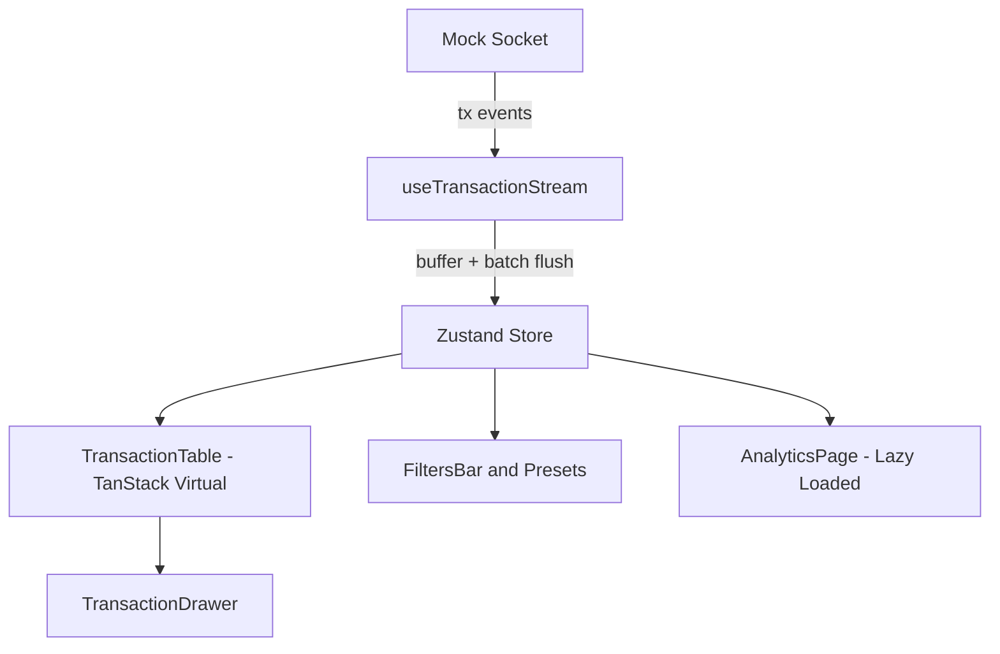
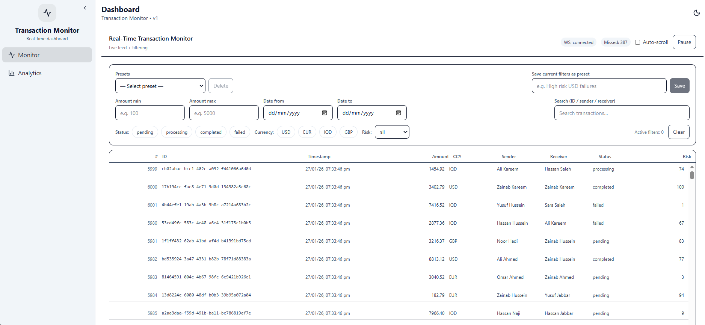
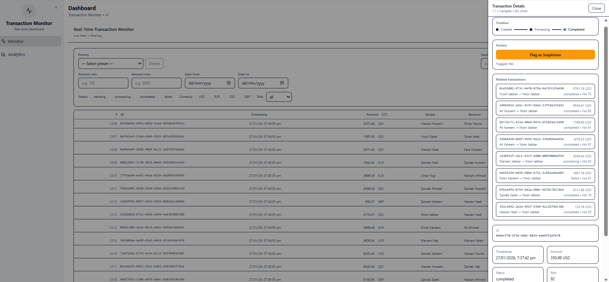
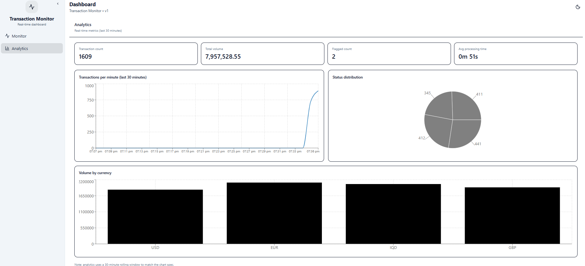

# Real-Time Transaction Monitor

Live Demo (Monitor): https://tx-monitor.vercel.app/monitor
Live Demo (Analytics): https://tx-monitor.vercel.app/analytics  
Repo: https://github.com/Maram-Qais/tx-monitor

A transaction monitoring dashboard for a financial operations team. It simulates a high-volume streaming WebSocket feed, supports advanced filtering + presets, transaction actions with optimistic updates, and a live analytics dashboard.

---

## Requirements Coverage

### 1) Live Transaction Feed
- Mock WebSocket service emits **50–100 transactions** in bursts every **2–3 seconds**, with random latency + occasional disconnects
- Virtualized table (TanStack Virtual) supports **10,000+ rows** smoothly
- Each row shows: **#**, ID, timestamp, amount, currency, sender, receiver, status, risk score
- New transactions appear at top with **highlight animation**
- Auto-scroll toggle (and viewport stability when auto-scroll is OFF)
- Pause/Resume uses React 19 **`<Activity>`** (state preserved when hidden)
- WebSocket message handlers use React 19 **`useEffectEvent`** (avoid stale closures)
- Connection status + auto-reconnect + missed indicator

### 2) Advanced Filtering & Search
- Multi-field filtering: amount range, date range, status, currency, risk level
- Debounced search across sender/receiver names + transaction IDs
- Filters apply to historical data **and incoming stream**
- Filter presets saved to `localStorage`, quick-apply saved filters
- URL state sync (filters reflected in URL, shareable links)

### 3) Transaction Detail & Actions
- Click row → slide-over drawer with full transaction details
- Transaction timeline: created → processing → completed/failed
- “Flag as Suspicious” uses React 19 **Actions + `useOptimistic`** for instant feedback
- Related transactions loaded using React 19 **`use()` + Suspense**
- Keyboard navigation: arrow keys to move between transactions, Escape to close
- Toast notifications for flag success/failure

### 4) Analytics Dashboard
- Summary cards: total volume, transaction count, flagged count, avg processing time
- Real-time line chart: transactions per minute (last 30 minutes, updates live)
- Pie chart: transaction distribution by status
- Bar chart: volume by currency
- Analytics is isolated on a separate route and lazy-loaded to avoid impacting table performance.

### 5) Performance & Error Handling
- Buffered/batched ingest to reduce render pressure under load
- Error boundaries with fallback UI
- Graceful disconnect handling + missed indicator
- Loading skeletons for initial/empty states

---

### 6) Architecture Overview

### High-level structure
- `src/services/` — mock socket + transaction generation
- `src/store/transactions/` — Zustand store + selectors
- `src/hooks/` — streaming, URL sync, etc.
- `src/components/transactions/` — table, filters, drawer
- `src/pages/` — Monitor + Analytics routes
- `docs/` — screenshots/GIF for README

### Data flow
1. `createMockSocket()` emits transactions in bursts (with latency + occasional disconnects).
2. `useTransactionStream()` subscribes using `useEffectEvent`, buffers incoming tx, and flushes in batches on an interval.
3. Store action `ingestBatch()` normalizes transactions into `byId`, prepends ids to `orderedIds`, and updates `filteredIds` by applying current filters to the incoming stream.
4. UI reads from the store using small selectors to minimize re-renders.
5. Analytics aggregates from the store, and is loaded on a separate route.

### Component diagram

### State Management Approach Justification (Zustand)
Zustand was chosen for high-frequency streaming updates:
- Normalized storage (`byId`) + ordered lists (`orderedIds`, `filteredIds`) keeps rendering fast and lookups O(1).
- Selectors let components subscribe to small slices of state, minimizing unnecessary re-renders.
- Cleanly separates data ingestion, filter logic, and UI state (paused/autoScroll/selectedId/connection status).

---

## Trade-offs / What I’d Improve With More Time
- Replace mock socket with a real `wss://` endpoint + proper replay/backfill strategy after reconnect.
- Scale to 1M+ tx using paging/windowing + indexing + Web Worker aggregation/filtering.
- Add unit tests for stream buffering + filtering, and an E2E test for the flag flow.
- Improve accessibility: focus trap/ARIA for drawer, keyboard hints, and richer empty states.

## Screenshots / Demo

### Monitor

### Transaction Drawer

### Analytics

